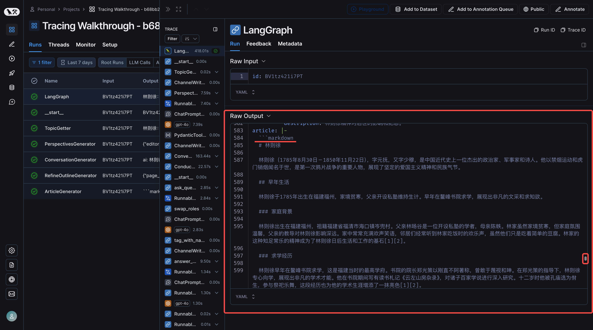
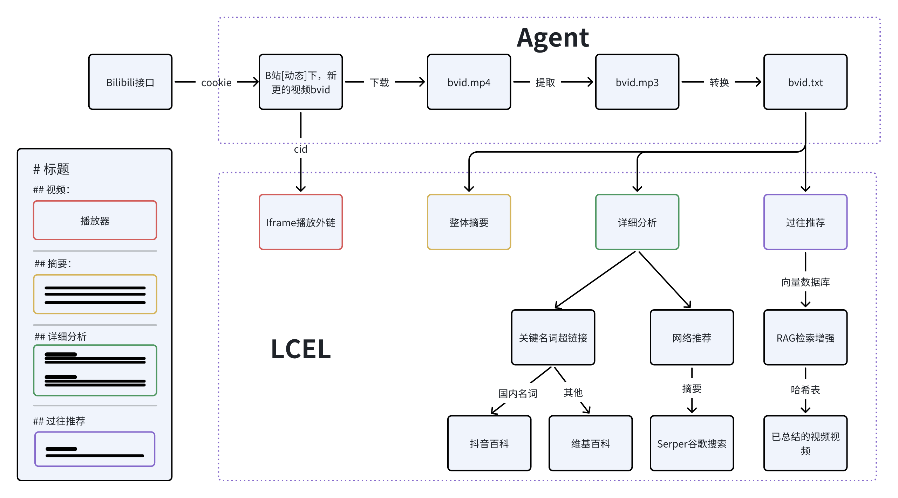
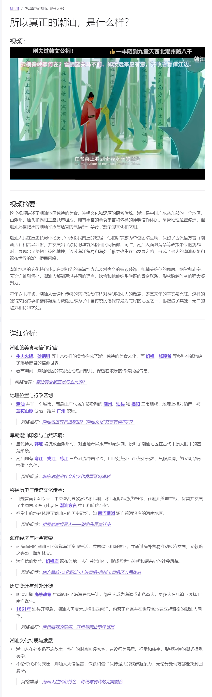
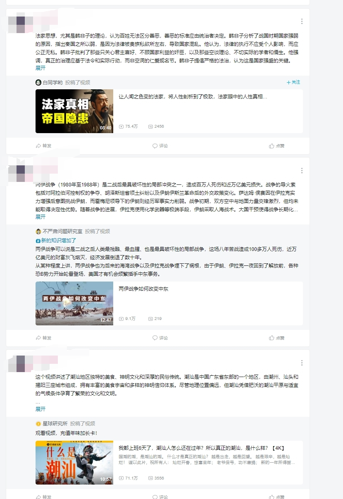

# 更新日志

## - ⛳️ 2024.7.29

### 项目实例运行

运行了一个项目实例，可以清晰的对比生成的结果(后续再优化)：

- 原视频：https://www.bilibili.com/video/BV1tz421i7PT/?vd_source=c5219caeb9fcd4170e838f52463fb5c4

- 视频原内容转化为 Markdown 文档: [林则徐的一生与鸦片战争
  ](/docs/video.md)

- 深入研究成果 Markdown 文档: [林则徐
  ](/docs/article.md)

- 上一步 langsmith 运行状态链接：
  https://smith.langchain.com/public/0d38e2cf-18c2-4a02-8ffa-1239edd6e96b/r



> 总耗时接近 600 s，每次运行消耗 10w token。 [捂脸]

## - ⛳️ 2024.7.20

### 项目结构优化

`src/dynamic` 目录下的内容是对 B 站视频内容进行摘要，并发送到 B 站。不同文件对应的是不同的实现。

`src/markdown` 目录下的内容是：

1. 转化为 Markdown 格式的视频内容。
2. 生成另一篇深入研究的 Markdown 文档。

## - ⛳️ 2024.7.8

该项目包括两个部分：

1. 将 B 站视频内容转化为文字，生成 Markdown 文档，并提取摘要发布到 B 站动态。
2. 深入研究视频内容，扩展其背景、深度和广度，以生成一个比原内容更饱满的 Markdown 博文。

参考资料：

- **仓库**：[stanford-oval/storm](https://github.com/stanford-oval/storm)
- **论文**：[arxiv.org/pdf/2402.14207](https://arxiv.org/pdf/2402.14207)

## - ⛳️ 2024.6.24

没想到这样一个 Demo 项目，竟然收到了一点关注，谢谢各位彦祖 🤵。

LangChain 更新太快了！这个项目已经有些过时，代码质量也很糟，因此不建议直接查看代码，你可以通过阅读 README 来了解项目的功能和实现。

正好在看新的工作机会，计划对这个项目进行重构。（如果你看到这里请插个眼，半个月之后再来查看 👋）

重构的内容将包括 LangGraph，Agent 设计模式，RAG，Milvus 等。另外，还会写一些关于 LangGraph 的教程，包括一些源码解读。因为我发现这方面的教程相对较少，而且现有的教程缺乏层次感和递进性。

---

# 目标

已关注的 up 主更新了视频之后，对视频进行摘要总结。一方面将摘要的内容在 B 站转发，另一方面对视频内容进行更详细的摘要分析，发表到 blog：https://minsixhao.github.io/docs/bilibili

# 实现方案


借助了 Langchain 框架，侧重使用了 chain 模块和 agent 模块，和最新的 LECL 声明式编程。

Agent 部分代码：

```
def agent_generate_bvid_resources(bvid):
    # 工具集
    tool_list = [mp4_2_mp3, mp3_2_text, summarize_text, create_bilibili_dynamic]

    model = ChatOpenAI()
    prompt_template = PromptTemplate(
        template="将视频文件{input},转换为音频，音频再转为文字,对文字进行总结摘要,将摘要发到b站。输出格式化为：{input}",
        input_variables=["input"],
    )

    agent = initialize_agent(tool_list, model, verbose=True, handle_parsing_errors=True,
                             agent=AgentType.ZERO_SHOT_REACT_DESCRIPTION)

    agent.invoke(prompt_template.format(input=bvid)).get("output")
```

LCEL 部分代码：

```
    model = ChatOpenAI()
    prompt_generate_markdown = PromptTemplate(
        template="""
            将你收到的三部分markdown内容做整合输出完整的markdown格式。
            输入分别对应视频:{iframe}，摘要：{summarize}，详细分析：{analyze}

            下面是输出的markdown格式:
            # 标题

            ## 视频：

            {iframe}

            ---

            ## 摘要：

            {summarize}

            ---

            ## 详细分析:

            {analyze}

            ---
        """,
        input_variables=["iframe", "summarize", "analyze"]
    )

    chain_generate_markdown = (
        {
            "iframe": agent_get_iframe_by_bvid,
            "summarize": get_sources_summarize,
            "analyze": get_analyze | extract_analyze_and_bold_keywords | prompt_keywords_to_link
        }
        | prompt_generate_markdown
        | model
        | StrOutputParser()
    )


```

# 效果

## Blog 展示效果：



## B 站动态效果:


